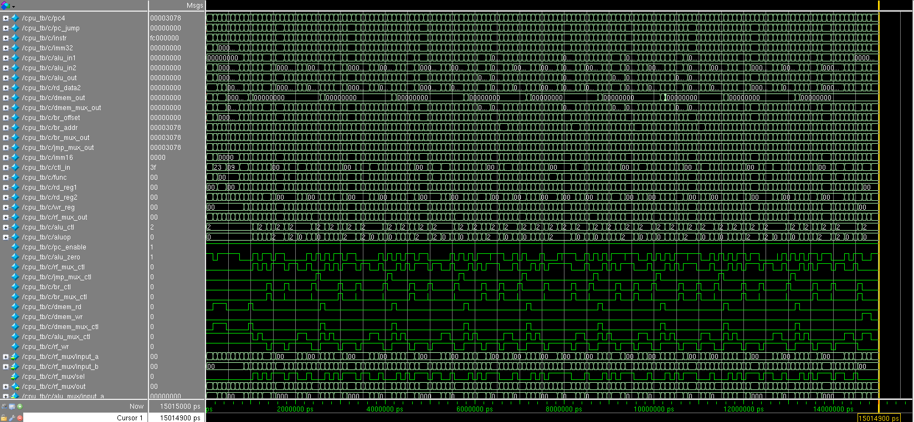
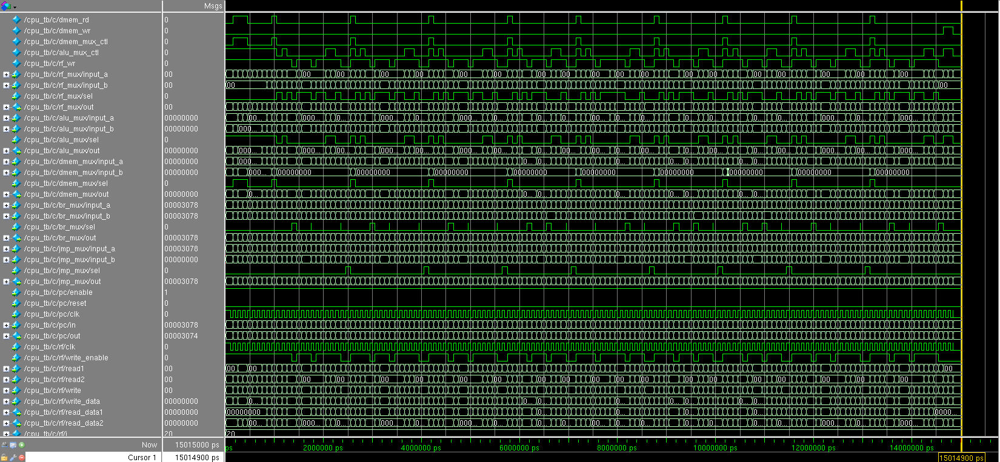
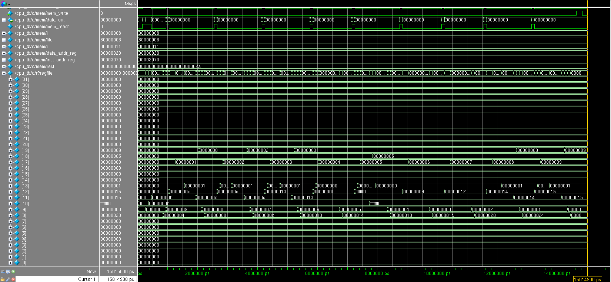

### (Mini) MIPS ISA Implementation

Mark Mossberg  
Northeastern University  
EECE 3324: Computer Architecture  
Professor Yunsi Fei  
December 5, 2014  

#### Design

To implement our processor, we needed to create Verilog modules
that simulated registers, a register file, multiplexers, and control
units, which were to be combined with a given memory module that
would provide the instruction and data memory for our processor.

We chose to use behavioral Verilog to model every module that needed
to be built, except the main CPU module itself.  This was due to
how much more rapidly behavioral Verilog can be developed as opposed
to structural Verilog and the higher level of abstraction that can
be worked at. We chose to implement the CPU module using structural
Verilog because implementing the CPU consisted mainly of connecting
the previously implemented modules, which is a task best fit by
structural Verilog.

Upon analyzing the reference CPU datapath, we noticed that many of
the smaller modules, such as the modules to increment the program
counter by four, bitwise AND the branch control signal and ALU zero
signal, sign extend, and shift left did not need to be implemented
as full modules, but instead could be implemented using concise
continuous assign statements, which helped to deal with the complexity
of managing the control signal namespace. Each module was tested
and simulated using a custom testbench to ensure the
functionality was correct, although this did not always correctly
confirm whether a module was correctly implemented.

#### Process

The development process of this MIPS implementation involved writing
various Verilog modules to represent and abstract different components
of the CPU datapath and then using a combination of the iverilog
and ModelSim simulators and custom testbenches to test the modules
and ensure proper functionality.  Once the modules were completed,
the process of integrating them together into a complete CPU was
started, which involved extensive use of ModelSim to simulate and
debug the various control circuits via waveform analysis. A provided
Verilog file containing instruction and data memory was used to
test the ability of the processor to execute instructions correctly.

The problems encountered during debugging were typically caused by
either an error using the ModelSim software or an error with the
CPU module wiring, and more rarely occurred due to logical
implementation mistakes. One such example of a logical error was
in the implementation of the `slt` instruction.  The initial
implementation did not take into account the signedness of the ALU
inputs and treated the inputs as unsigned when they were in fact
signed.  At this point we had an otherwise fully functional CPU and
were confused at why the final state of the register file was very
subtly off from the given final register file state.

At the beginning of the testing stage our processor did not function
at all because it was not reading instructions from memory. This
ended up being caused by a software usage error in which the hexdump
memory file was not placed in the correct location on the file
system. After, the main issues were getting the program counter to
increment correctly, getting the proper control signals each cycle,
and fixing any other miscellaneous wiring issues that caused modules
to fail. Lastly, the above logic error was fixed.

<div style="page-break-after: always;"></div>

#### Results

Our results matched the given results, except for the cycle/instruction
count which is 151 instead of 149.

- Total Cycles: 151  
- Total Instructions: 151  
- CPI: 1  

Register File Contents:

```
 R0:   0x0  || R1:   0x0 || R2:   0x0        || R3:   0x0
 R4:   0x0  || R5:   0x0 || R6:   0x0        || R7:   0x0
 R8:   0x28 || R9:   0x0 || R10:  0xfffffff0 || R11:  0x15
 R12:  0x15 || R13:  0x1 || R14:  0x0        || R15:  0x0
 R16:  0x0  || R17:  0x9 || R18:  0x5        || R19:  0x9
 R20:  0x0  || R21:  0x0 || R22:  0x0        || R23:  0x0
 R24:  0x0  || R25:  0x0 || R26:  0x0        || R27:  0x0
 R28:  0x0  || R29:  0x0 || R30:  0x0        || R31:  0x0
```

Screenshots:





